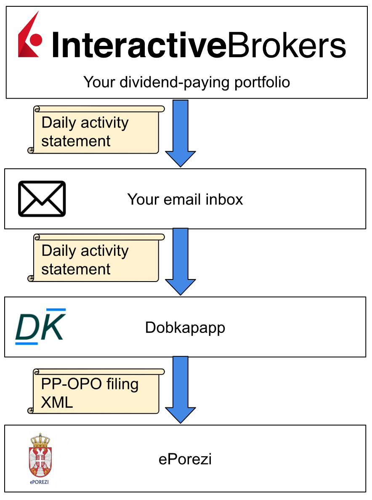

## Dobkapapp

Dobkapapp is a desktop application for automating PP-OPO dividend tax filings in Serbia. It can
import dividend payout data from InteractiveBrokers activity statements in your email inbox and
produce PP-OPO XML tax filings ready to be uploaded to ePorezi.

## Features
### Transports
  - Reads from your email inbox through IMAP
  - Supports optional filtering by sender, subject and attachment name
  - Can handle statements from multiple brokerage accounts in the same inbox

### Input formats
  - Supports Interactive Brokers CSV format

### Tax code
  - Handles withholding tax deductions
  - Calculates filing/payment deadlines based on weekends and public holidays
  - Supports EUR, USD and GBP dividends by scraping exchange rates off the NBS public website
  - Supports SGD dividends by calculating a cross rate (scraping the NBS public website and
  using the Monetary Authoritary of Singapore API)
  - Supports MXN dividends by calculating a cross rate (scraping the NBS public website and
  using the Banco de Mexico API)

### Platforms
  - Windows x64
  - Mac x64
  - Mac arm64 (Apple Silicon)

## User guide
- Before using Dobkap you will need to configure your brokerage account to send daily activity
statements via email.
- Download and install a Dobkapapp binary suitable for your platform
- Open Dobkapapp
- Configure mailbox settings and taxpayer settings
  - Initially the mailbox date cursor will be set to today. Move this a few days into the past
  (depending on how many days of activity statements you would like to process on the first sync)
- Add an importer and configure importer settings
- Dobkapapp now has all the information it needs. Click 'sync' to download and process activity
statements
- Go to the 'filings' tab to see tax filings produced by Dobkapapp. Click 'Save as' to export
a filing ready to be uploaded to ePorezi
- Click 'sync' again to process new activity statements. Dobkapapp should remember which activity
statements it has already processed to avoid duplicate filings
