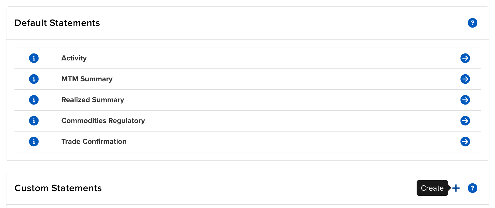
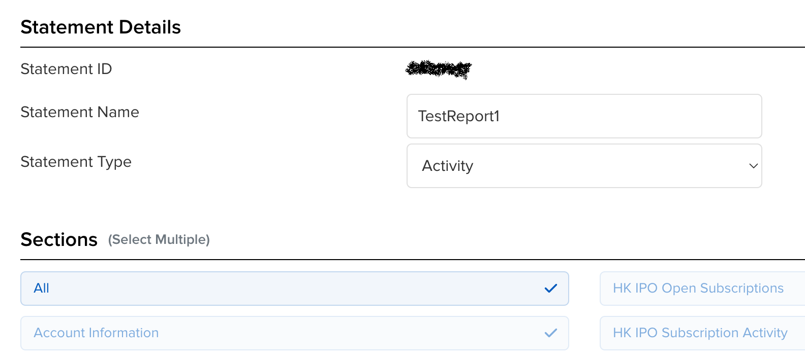
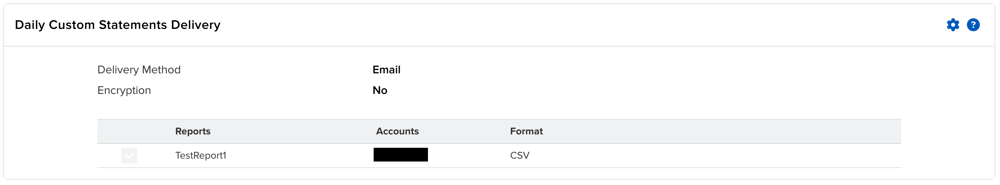
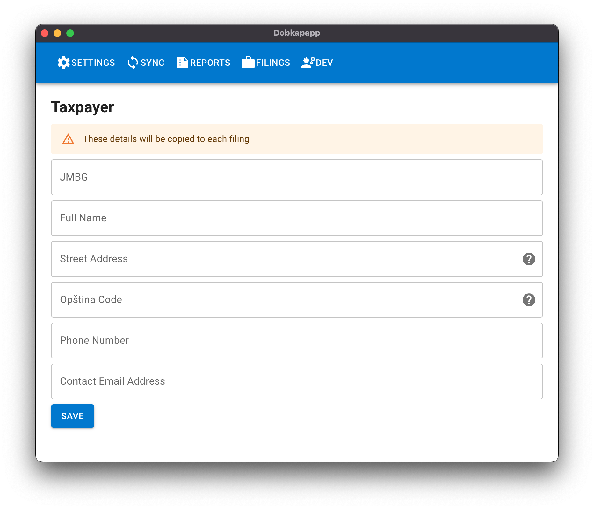
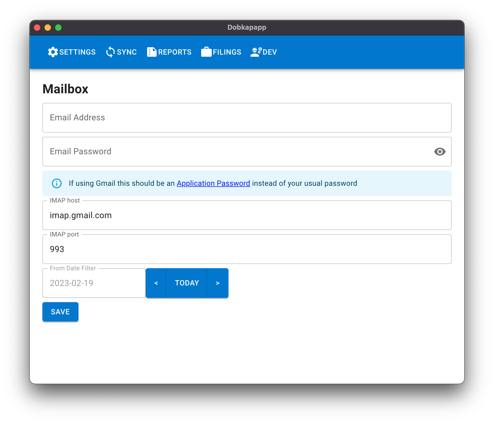
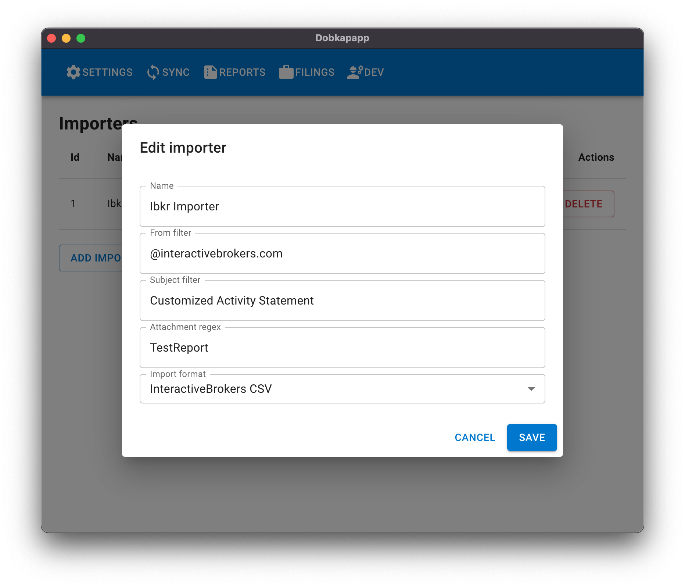
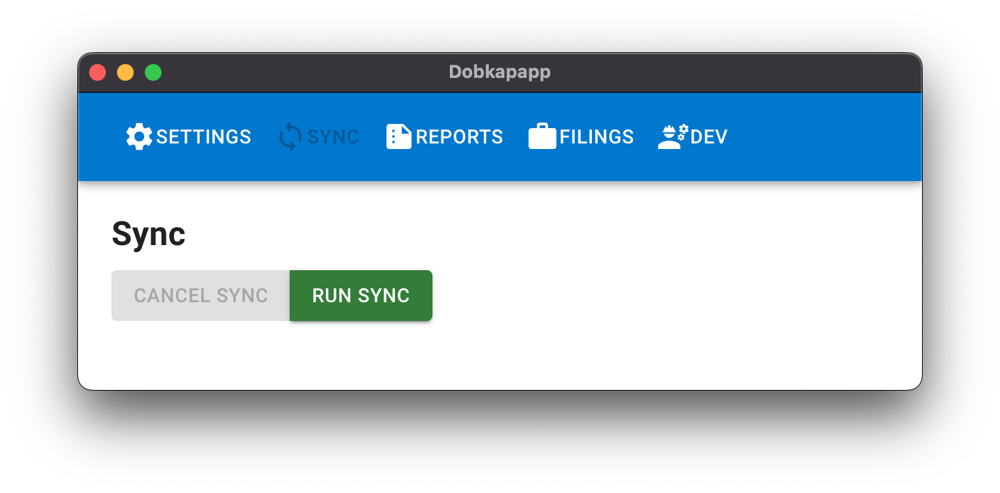
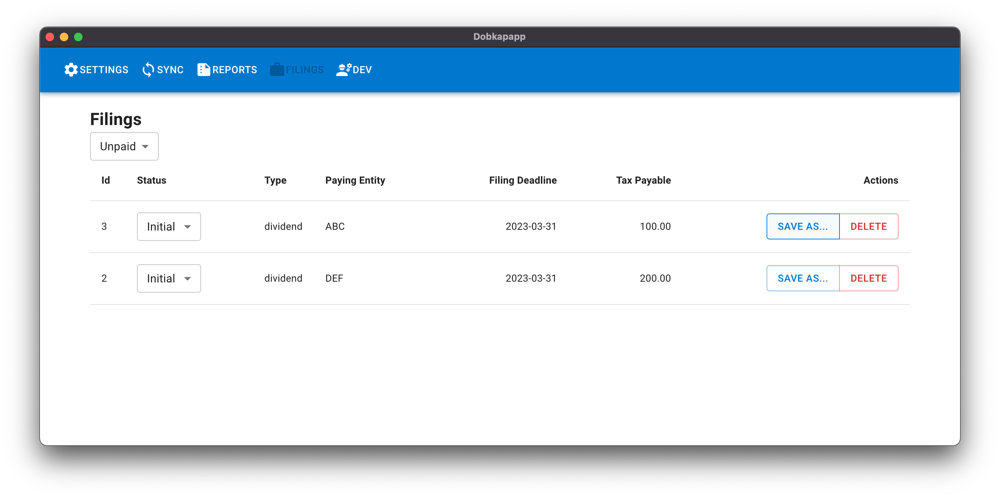
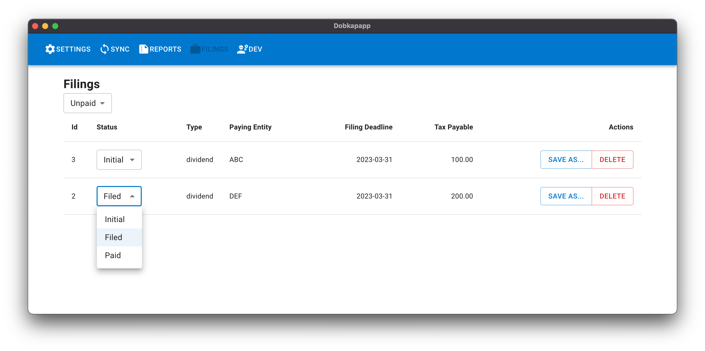
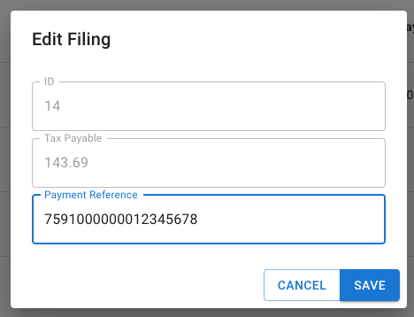

## Dobkapapp

Dobkapapp is a desktop application for automating PP-OPO passive income tax filings in Serbia. It can
import dividend and interest data from InteractiveBrokers activity statements in your email inbox and
produce PP-OPO XML tax filings ready to be uploaded to ePorezi.

## Features

- Supports Interactive Brokers CSV format
- Reads from your email inbox through IMAP
- Supports optional filtering by sender, subject and attachment name
- Can handle statements from multiple brokerage accounts in the same inbox
- Allows you to track filing statuses
- Allows you to track payment references between filing and paying

### Tax code features
  - Handles withholding tax deductions
  - Calculates filing/payment deadlines based on weekends and public holidays
  - Supports multiple currencies by scraping exchange rates off the NBS public website
  - Supports SGD currency by calculating a cross rate (scraping the NBS public website and
  using the Monetary Authoritary of Singapore API)
  - Supports MXN currency by calculating a cross rate (scraping the NBS public website and
  using the Banco de Mexico API)

### Platforms
  - Windows x64
  - Mac x64
  - Mac arm64 (Apple Silicon)

## User guide
- Before using Dobkapapp you will need to configure your brokerage account to send daily activity statements via email. This is how to do it for Interactive Brokers:
  
  
  
- Download and install a Dobkapapp binary suitable for your platform
  - If you using macOS and see an error such as 'App is damaged and can't be opened', it could be because the binary is quarantined. Try opening the terminal and running a command like `xattr -d com.apple.quarantine /path/to/dobkapapp.app`.
- Open Dobkapapp
- Configure mailbox settings and taxpayer settings
  - Initially the mailbox date cursor will be set to today. Move this a few days into the past
  (depending on how many days of activity statements you would like to process on the first sync)
  
  
- Add an importer and configure importer settings
  
- Dobkapapp now has all the information it needs. Click 'sync' to download and process activity
statements
  
- Go to the 'filings' tab to see tax filings produced by Dobkapapp. Click 'Save as' to export a filing ready to be uploaded to ePorezi
  
- Use the status dropdowns to keep track of which filings have been filed and paid
  
- Next time you open the app, simply click 'sync' again to process new activity statements. Dobkapapp should remember which activity
statements it has already processed to avoid duplicate filings
- When a filing has been submitted to ePorezi, mark the filing as 'Filed' and enter the payment reference

  
- When a filing has been paid, mark it as 'Paid'
